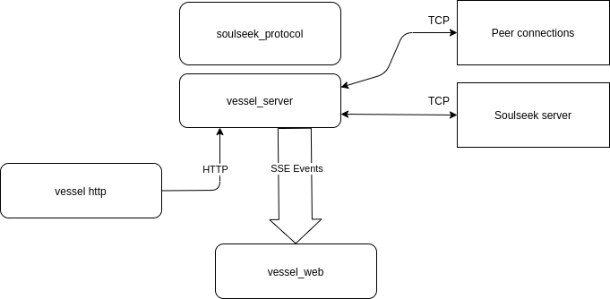

## Vessel 

**WORK IN PROGESS**

## Useful links

- [soulseek protocol messages](https://nicotine-plus.github.io/nicotine-plus/doc/SLSKPROTOCOL.html#server-code-1)
- [nicotine+](https://github.com/Nicotine-Plus/nicotine-plus)
- [museek+](https://github.com/eLvErDe/museek-plus)

## Running

### vessel server
```shell
RUST_LOG=debug cargo run
```

### vessel web
```shell
cd vessel_web
npm install
npm run dev
```

## Architecture

### modules 

- [soulseek_protocol](soulseek_protocol) :
  This crate provide serializaion and deserialisation for soulssek TCP message.
  
- [vessel_sse](vessel_sse) : Dispatch message from soulseek to the web client.
    Messages are sent in json format with the following content : 
    ```json
  {
      "UserJoinedRoom": { // message type
        // content ...
        "room": "ARGENTINA",
        "username": "vessel",
        "status": 2,
        "avgspeed": 0,
        "downloadnum": 0,
        "files": 0,
        "dirs": 0,
        "slotsfree": 0,
        "countrycode": "FR"
      }
    }
    ```
  For a list of available messages run the following command : 
  ```shell
  cargo doc --workspace
  cargo doc --open
  ```
  And browse to `soulseek_protocol/server_message/request/enum.ServerRequest.html`

  
- [vessel_server](vessel_server) :
  The main process : 
    - Initiate logging
    - Spawn TCP listeners (Soulseek server + outgoing/incoming distributed connections).
    - Spawn HTTP and SSE task.
    - Send login credentials to soulseek after every process has started.
  
  
- [vessel_http](vessel_http) : 

  REST api endpoints to communicate with the server, note that these endpoints are "write only".
  most of them will answer with 202/Accepted, response will be later send via server sent event.
  
- [vessel_web](vessel_web) :

  A web application, sending request via HTTP and getting response asynchronously via SSE. 

### Message flow diagram 


